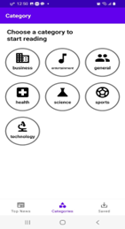

# Wanted_preonboarding_android
원티드 프리온보딩 안드로이드 사전과제
뉴스 앱 서비스

| | | | | 
|:---:|:------:|:-----:|:-----:|
| Top News | Detailed | Category | Saved |
# About
### ✨기능
* 최신 뉴스 리스트 조회
* 카테고리 선택
* 카테고리별 뉴스 리스트 조회
* 상세 뉴스 조회
* 뉴스 저장(북마크)
* 저장된 뉴스 리스트 조회
### 🛠 Build with
* Language: kotlin
* Architecture Pattern : MVVM Pattern
* DataBinding
* Coroutine
* Navigation Component
* Hilt
* Retrofit
* room
* Gilde